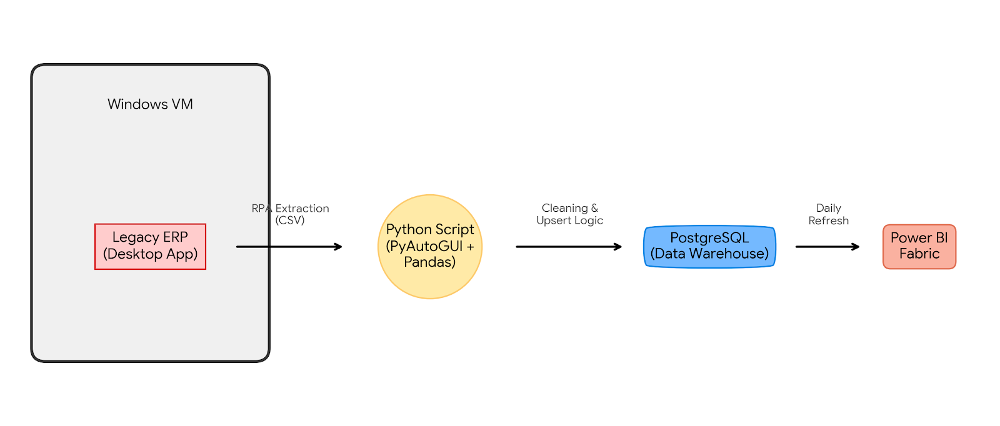
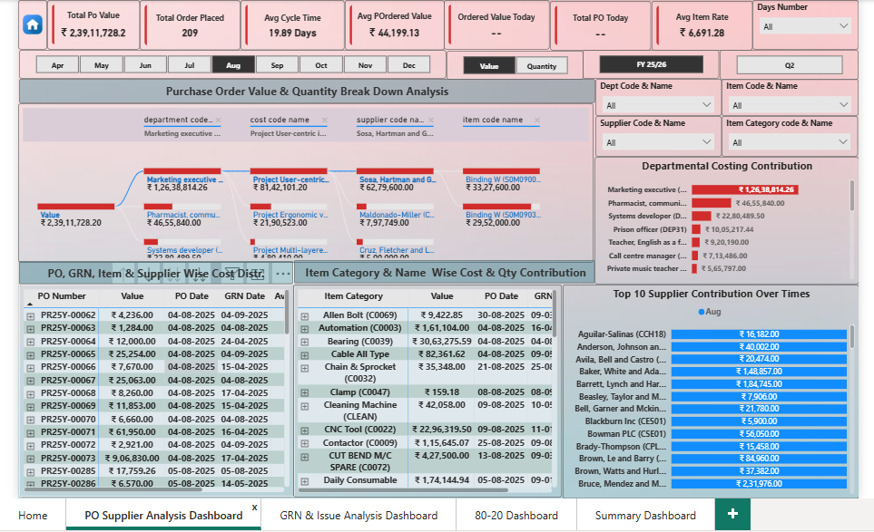
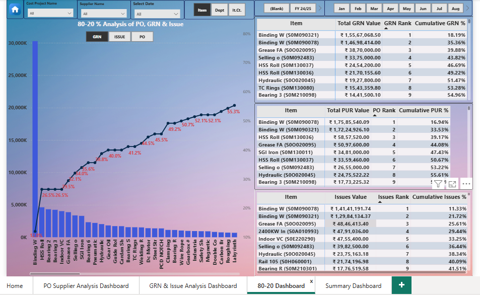

# SCM-Data-Bridge: End-to-End Supply Chain Automation


## 📖 Executive Summary

**SCM-Data-Bridge** is a full-stack data engineering solution developed at **Automatrix Innovation** to bridge the gap between legacy ERP systems and modern Business Intelligence.

Many manufacturing sectors still rely on legacy desktop ERPs (like Lighthouse ERP) that lack API connectivity. This project automates the manual extraction of daily data using **RPA (Robotic Process Automation)**, processes it via Python to handle duplicates and updates (SCD Type 1), and loads it into an on-premise PostgreSQL warehouse. The final output is a Power BI Fabric dashboard used for daily procurement and inventory decision-making.

**Business Impact:**
* **Zero Manual Entry:** Replaced 2+ hours of daily manual Excel export/cleaning with a fully automated script.
* **Data Latency:** Reduced reporting lag from 24 hours to <1 hour (Daily 10:00 AM Run).
* **Inventory Visibility:** Enabled 80/20 Pareto analysis to identify high-value stock items.

---

## 🏗️ System Architecture



**The Data Pipeline Flow:**
1. **Extraction (10:00 AM):** A Python script (`pyautogui` + `pywinauto`) wakes the VM, logs into the legacy ERP client, and navigates UI menus to export raw CSVs for Purchase Orders, GRN, and Issues.
2. **Transformation (10:15 AM):** `Pandas` cleans the data, parses dates, and formats columns.
3. **Loading (Upsert Logic):** Data is pushed to **PostgreSQL**. A custom "Upsert" function checks for existing records:
   * *New Records* → INSERT
   * *Existing Records* → UPDATE (SCD Type 1) to reflect changes in quantity or status.
4. **Reporting (11:00 AM):** Power BI On-Premises Data Gateway refreshes the dashboard.
5. **Alerting:** SMTP email triggers send a status report (Success/Fail) with attached CSVs to stakeholders.

---

## 📊 Dashboard & Reporting

The data feeds into a multi-page Power BI report. Below are the results generated from the pipeline.

### 1. Executive Procurement Analysis

*Breakdown of open Purchase Orders by supplier and department. Highlights the total liability (₹2.39 Cr) and average cycle time.*

<details>
<summary><b>🔻 Click to view Page 2: GRN & Delivery Analysis</b></summary>


*Tracks the conversion of Orders to Goods Receipt Notes (GRN). Monitors the ratio of Revenue Stock vs. Capital Stock.*
</details>

<details>
<summary><b>🔻 Click to view Page 3: Strategic 80/20 Inventory Control</b></summary>


*Pareto analysis identifying the critical 20% of SKUs that drive 55% of inventory value.*
</details>

<details>
<summary><b>🔻 Click to view Page 4: Data Lineage Summary</b></summary>


*Tabular view used for auditing specific transaction IDs against the ERP.*
</details>

---

## 📂 Project Artifacts
You can access the source files and generated reports here:

| File Type | Location | Description |
| :--- | :--- | :--- |
| **Power BI File** | [`dashboards/Supply_Chain_Analysis.pbix`](dashboards/) | The raw source file containing the DAX measures and data model. |
| **Sample Report** | [`reports/Executive_Supply_Chain_Report.docx`](reports/) | An automated Word document generated daily for stakeholders. |
| **SQL Schema** | [`sql/init_schema.sql`](sql/init_schema.sql) | The PostgreSQL table definitions and View logic. |

---

## 💻 Technical Implementation

### 1. The "Upsert" Logic (PostgreSQL + Python)
One of the main challenges was handling data that changes retroactively (e.g., a PO quantity is revised). Simply appending data would create duplicates. I implemented a robust `INSERT ... ON CONFLICT DO UPDATE` strategy.

```python
# snippet from src/etl_process.py
insert_sql = """
INSERT INTO pur_order_daily_main (
    order_date, item_code, order_number, order_value, 
    bal_qty, rate, department, cost_project
) VALUES (%s, %s, %s, %s, %s, %s, %s, %s)
ON CONFLICT (order_date, item_code, order_number, department, cost_project)
DO UPDATE SET
    order_value = EXCLUDED.order_value,
    bal_qty = EXCLUDED.bal_qty,
    rate = EXCLUDED.rate;
"""
```

### 2. RPA for Legacy ERP
Since the ERP has no API, I used `pyautogui` for visual navigation and `pywinauto` for window handling.

```python
# snippet from src/automation.py
def focus_lighthouse_window():
    try:
        windows = gw.getWindowsWithTitle('Lighthouse ERP')
        window = windows[0]
        window.activate() 
        
        # Automates the "Print" -> "Export to CSV" flow
        pyautogui.click(615, 573) 
        time.sleep(3)
        
        # ... navigation logic
    except Exception as e:
        print(f"Error: {e}")
```

---

## 🛠️ Installation & Setup
> **Note:** Because this project relies on specific local legacy software (Lighthouse ERP) and a Windows VM, the extraction scripts cannot be run directly on a standard machine. However, the Database and Transformation logic can be tested.

### Clone the Repo
```bash
git clone [https://github.com/ShubhrajyotiPoddar/scm-data-bridge.git](https://github.com/ShubhrajyotiPoddar/scm-data-bridge.git)
cd scm-data-bridge
```

### Install Dependencies
```bash
pip install -r requirements.txt
```

### Database Setup
I have provided a schema initialization script to spin up the Postgres structure (Tables + Views) with dummy data.
```bash
# Run the SQL script in your local Postgres instance
psql -U postgres -d supply_chain_db -f sql/init_schema.sql
```

---

## ⚠️ Security & Privacy Note
This repository demonstrates a portfolio project. To ensure security:
* **Fake Data:** All data shown in screenshots and the database seed is randomized/anonymized (sanitized). No real company PII or financial data is present.
* **Redacted Credentials:** Database passwords, ERP logins, and Server IPs in the source code have been replaced with placeholders (e.g., `REDACTED_CREDENTIAL`).

In a production environment, these are managed via `os.environ` variables or Azure Key Vault.

---

## 👤 Author
**Shubhrajyoti Poddar** Data Engineer | BI Developer
[LinkedIn Profile](https://www.linkedin.com/in/shubhrajyoti-poddar-506752390/)